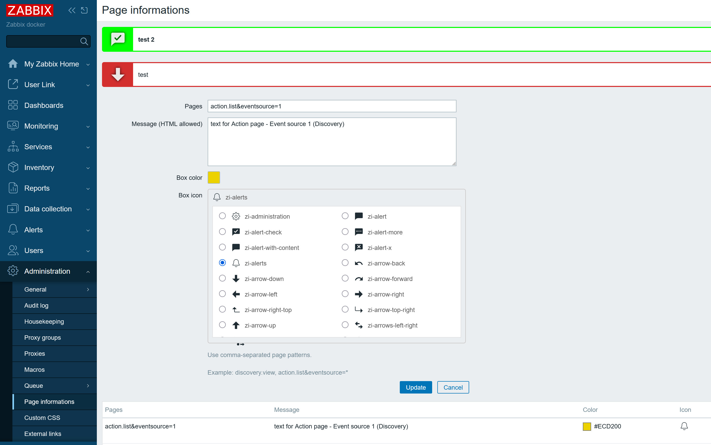
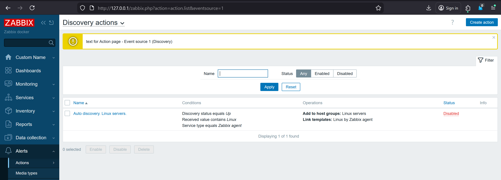
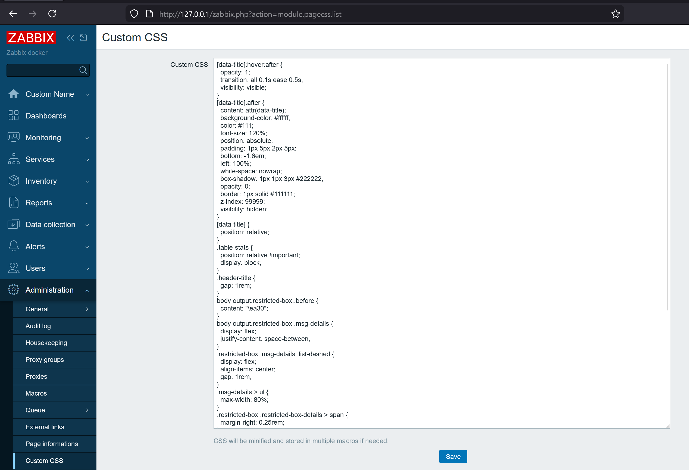

# CSSandInfos Zabbix Module

CSSandInfos is a Zabbix 7.0 frontend module that adds two admin tools:
1) Page informations: show custom HTML notices on selected Zabbix pages.

2) Custom CSS: inject global CSS across the frontend.

Both tools store their data as global macros, so no DB schema changes are needed.

## Features
- Page informations UI under Administration.
- Custom CSS UI under Administration.
- Messages are matched by page action patterns.
- Per-message color and icon selection.
- Custom CSS is minified, split across multiple macros, and injected at runtime.
- Readable CSS view in the admin screen (de-minified).

## Requirements
- Zabbix 7.0 (frontend module)

## Installation
1) Copy this repository into your Zabbix modules directory (default: `/usr/share/zabbix/`).
2) Go to Administration -> General -> Modules, click Scan directory, and enable the module.
3) Use:
   - Administration -> Page informations
   - Administration -> Custom CSS

## Page informations
This feature shows a notice box below the page title when the current `action` matches a pattern.
Each message can use its own color and icon.

### Pattern format
The pattern matches the `action` parameter in the URL and can include optional query keys.

Examples:
- `discovery.view`
- `action.list&eventsource=*`
- `service.list&serviceid=5`
- Multiple pages in one entry: `dashboard.list, service.list`

### Storage
Each entry is stored as a global macro:
- `{$PAGEINFO:<pattern>|<id>}`
Macro value is JSON: `{"message":"<html>","color":"RRGGBB","icon":"EA30"}`.

The module reads these macros and injects the message after the page title.

## Custom CSS
This feature lets you define CSS that is injected into all Zabbix pages.

### How it works
1) The UI saves your CSS.
2) CSS is minified and split into chunks that fit the macro length limit.
3) Chunks are stored as global macros:
   - `{$PAGECSS:1}`, `{$PAGECSS:2}`, ...
4) Frontend JS reads all `{$PAGECSS:*}` macros, concatenates them, and injects a `<style>` tag.

The admin UI de-minifies the stored CSS for readability.

## Notes
- HTML is allowed in page messages. Only trusted admins should edit these entries.
- If you remove all CSS and save, all `{$PAGECSS:*}` macros are deleted.
